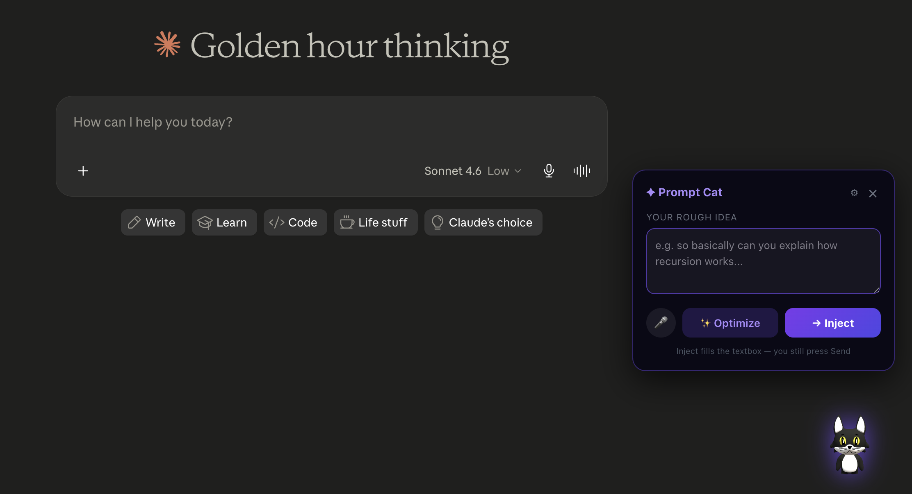
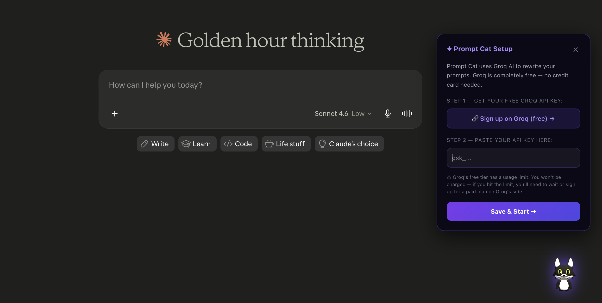
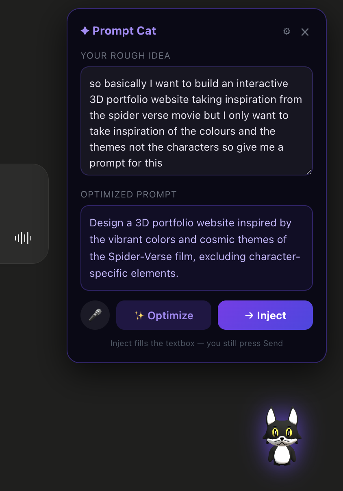

# 🐱 Mochi AI — AI Prompt Cat

> A floating 3D AI-powered Chrome extension that rewrites your rough ideas into sharp, token-efficient prompts — directly inside ChatGPT and Claude.

---

## 📸 Screenshots

> What happens when a floating cat meets prompt engineering.

### The Cat



<!-- Replace the line above with your actual screenshot of the 3D cat on screen -->

### Setup Screen (first launch)



<!-- Replace with a screenshot of the Groq API key setup UI -->

### Optimizer in Action



<!-- Replace with a before/after screenshot of a prompt being optimized -->


## What It Does

Most people type rambling, vague prompts and get mediocre AI responses. Mochi AI fixes that.

Click the floating 3D cat on any ChatGPT or Claude page, type your rough idea, hit **Optimize** — and Mochi rewrites it into a clean, intent-focused prompt using Groq's LLM API. Then hit **Inject** to drop it straight into the textbox.

**Before:**
> "ok so I basically want to build a website which has to take references from the spider-verse movie and everything but then I don't want the..."

**After:**
> "Build a Spider-Verse inspired website with dynamic comic-panel layouts, multi-dimensional UI transitions, and a modular design system."

---

## Features

- **3D Animated Cat** — rendered with Three.js + GLTFLoader, draggable anywhere on screen
- **AI Prompt Optimizer** — powered by Groq's `llama-3.1-8b-instant`, rewrites prompts in under a second
- **One-time Setup** — users paste their own free Groq key once; stored securely in Chrome local storage
- **Voice Input** — Web Speech API integration for hands-free prompt entry
- **Smart Injection** — injects optimized prompt directly into ChatGPT and Claude textboxes
- **Zero Cost to Deploy** — users bring their own free Groq key; no backend, no server, no bill
- **Keyboard Shortcut** — `Cmd+Enter` / `Ctrl+Enter` to inject instantly

---

## 📥 How to Download & Install

Follow these steps exactly — it takes about 3 minutes.

### Step 1 — Download the extension

**Option A — Download as ZIP (easiest):**
1. Click the green **Code** button at the top of this page
2. Click **Download ZIP**
3. Unzip the downloaded file somewhere easy to find (e.g. your Desktop)

**Option B — Clone with Git:**
```bash
git clone https://github.com/yourusername/mochi-ai.git
```

---

### Step 2 — Load it into Chrome

1. Open a new tab and go to:
   ```
   chrome://extensions
   ```
2. In the **top-right corner**, turn on **Developer Mode** (the toggle switch)
3. Click the **"Load unpacked"** button that appears
4. In the file picker, navigate to and select the folder you unzipped in Step 1
   - Make sure you select the folder that contains `manifest.json` directly inside it
5. The Mochi AI cat should now appear in your extensions list ✅

> If you see an error saying "Could not load", make sure you selected the right folder — it should contain `manifest.json`, `content.js`, and the `models/` folder.

---

### Step 3 — Get your free Groq API key

Mochi AI uses Groq to power the optimizer. Groq is **completely free** — no credit card required.

1. Go to 👉 [console.groq.com/keys](https://console.groq.com/keys)
2. Click **Sign Up** and create a free account
3. Once logged in, click **"Create API Key"**
4. Give it any name (e.g. "Mochi AI")
5. Copy the key — it starts with `gsk_...`

> ⚠️ Groq's free tier gives you hundreds of calls per day. You won't be charged. If you hit the daily limit, just wait until the next day — it resets automatically.

---

### Step 4 — First launch

1. Open [chatgpt.com](https://chatgpt.com) or [claude.ai](https://claude.ai)
2. You'll see a **small 3D cat** in the bottom-right corner of the page
3. Click the cat — a setup screen will appear
4. Paste your Groq API key into the input field
5. Click **"Save & Start"**

You're done. The key is saved — you'll never need to do this again. 🎉

---

## 🐾 How to Use

Once set up, using Mochi AI is simple:

| What you want to do | How to do it |
|---|---|
| Open the Mochi AI panel | Click the 3D cat |
| Close the panel | Click the cat again, or press × |
| Move the cat | Click and drag it anywhere on screen |
| Type your rough idea | Type in the "Your rough idea" box |
| Use your voice instead | Click 🎤 and speak — it types for you |
| Optimize your prompt | Click **✨ Optimize** |
| Send the optimized prompt to the AI | Click **→ Inject** |
| Inject with keyboard | Press `Cmd+Enter` (Mac) or `Ctrl+Enter` (Windows) |
| Change your API key | Click ⚙ in the top-right of the panel |

> 💡 **Inject does not send the message** — it just fills the textbox. You still press Enter or the Send button yourself, so you can review it first.

---

## Extension Architecture

```
mochi-ai/
├── manifest.json          # Chrome Manifest V3 config
├── content.js             # All extension logic (UI, optimizer, injector)
├── content.css            # Styles for the floating cat container
├── three.min.js           # Three.js r128 — 3D rendering engine
├── GLTFLoader.js          # GLTF/GLB model loader (Three.js addon)
└── models/
    └── cartoon_cat.glb    # Animated 3D cat model
```

### Key Design Decisions

| Decision | Rationale |
|---|---|
| Single `content.js` file | Keeps the extension simple, hackathon-friendly, easy to audit |
| Manifest V3 | Required for modern Chrome extensions; uses `host_permissions` for Groq API |
| `chrome.storage.local` | Persists API key across sessions without a backend |
| Groq over OpenAI/Anthropic | Free tier, no credit card, fastest inference available |
| `llama-3.1-8b-instant` | Fast, capable, free on Groq — ideal for prompt rewriting |
| User-supplied API key | Zero cost to the developer; users control their own usage |

---

## How the Optimizer Works

The optimizer does **not** use regex or string manipulation. It sends the user's raw input to Groq's chat completions API with a carefully engineered system prompt:

```
Extract core intent → Remove filler and hedging → Rewrite as a clean,
concise AI prompt under 30 words → Output only the rewritten prompt
```

The model used is `llama-3.1-8b-instant` via Groq's OpenAI-compatible endpoint:

```
POST https://api.groq.com/openai/v1/chat/completions
```

---

## Browser Compatibility

| Browser | Support |
|---|---|
| Chrome 114+ | ✅ Full support |
| Edge (Chromium) | ✅ Full support |
| Brave | ✅ Full support |
| Firefox | ❌ Not supported |
| Safari | ❌ Not supported |

---

## Works On

| Site | Status |
|---|---|
| [chatgpt.com](https://chatgpt.com) | ✅ |
| [chat.openai.com](https://chat.openai.com) | ✅ |
| [claude.ai](https://claude.ai) | ✅ |

---

## Roadmap

- [ ] Support for Gemini API as an alternative backend
- [ ] Prompt history (last 10 optimized prompts)
- [ ] Custom system prompt editor for power users
- [ ] Firefox / Edge Web Store releases
- [ ] Prompt templates by category (coding, writing, research)

---
